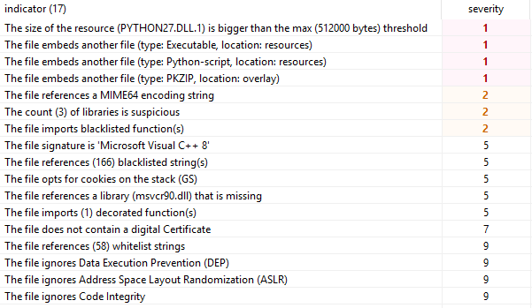
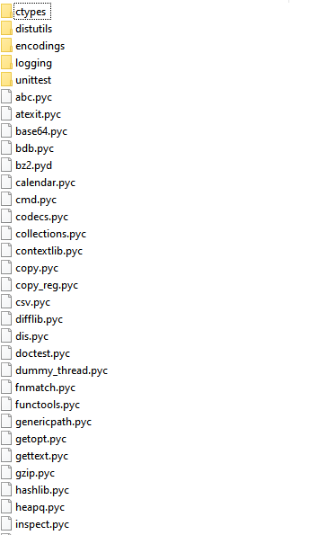
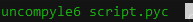
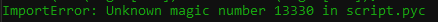
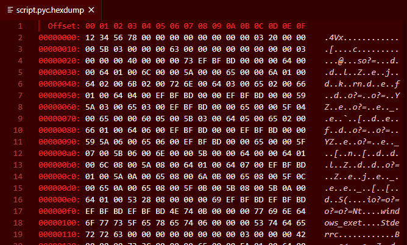
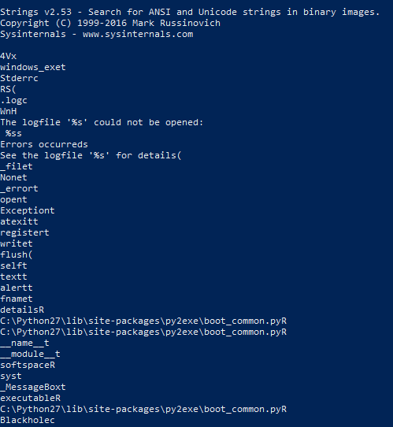
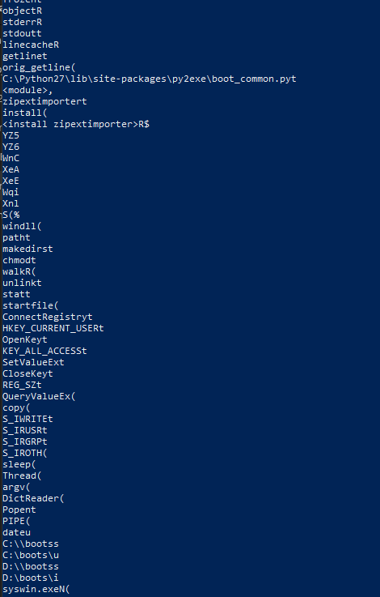
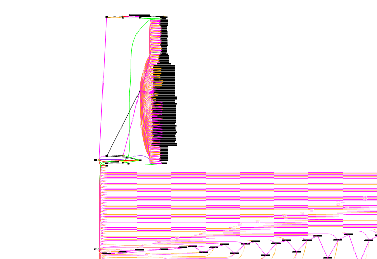
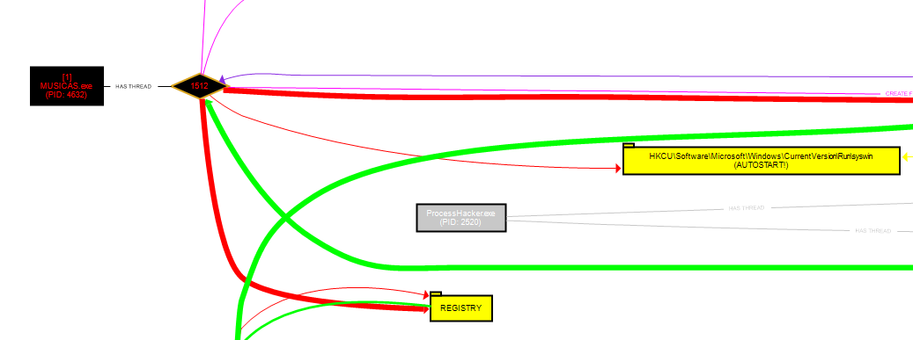
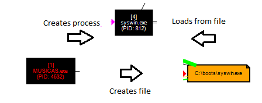

# Skeeyah Malware RE

Sunday, 26 July 2020

## Skeeyah 
**MD5**: 08438a9f38b7ed708b65620e5eeafdd5
#### From: <https://www.virustotal.com/gui/file/395be2c11f0a374b305df20f856dfcf3d1441045ee05073fe1b84a2d792a7b00/details> 

**Observed Filenames**: 
 - F:/MUSICAS.exe
 - C:/boots/syswin.exe

Shows signs of persistence, destructive behavior and was seen on multiple systems, suggesting propagation.

## Initial static analysis
First we load up the executable in PEStudio.
Compiler timestamp can be faked, but shows 
compiler-stamp: (Mon Nov 10 04:40:35 2008)
This could indicate an older malware. Again, this value is often faked by malware authors.

We can see there is a full Python executable embedded in resources, along with a Python script. We also note a zip file embedded.
Dumping the zip file shows many standard and custom python library files:

We also note that there are some dangerous functions imported by the malware, allowing it capabilities including anti-analysis, dynamic function imports, and memory allocation and manipulation. This usually implies that to really understand how it works, a combination of static and dynamic analysis will be required.
Extracting and dumping the Python script shows that it is a compiled python binary. We can try decompiling it with uncompyle6 but it fails:

This is usually an indicator that the python version is a mismatch. Let's open the .pyc in a hex editor to have a look. Indeed, we see that the .pyc header has been manipulated by the malware author to make it harder to reverse engineer, with the hex 12345678 clearly not part of the regular .pyc header format.

Extracting strings from the .pyc file shows some interesting features. We can see that the .pyc was generated by py2exe, and the final string "Blackhole" is a name of a common but powerful exploit kit.

We also get hints at functionality such as registry access and file and directory manipulation. Especially relevant are the strings C:\boots\ and syswin.exe, which is where the malware was found on a victim's machine. So the Python script is most likely responsible for the propagation and persistence aspects of the malware.

## Dynamic analysis
Windows detonation environment details:
OS Name: Microsoft Windows 10 Enterprise
Version: 10.0.16299 Build 16299
On a fresh instance of the detonation environment with simulated networking and ProcMon running, the malware was executed. The results were loaded into ProcDot for virtualization and we see a large amount of activity.

## Reverse engineering

